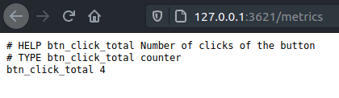
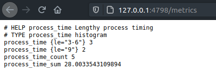

# Shiny Basics

In this wee vignette we give just basic examples of how to use titan in shiny applications.

## Counter

Below is a very basic shiny application that simply logs clicks of a button.

```r
library(shiny)

ui <- fluidPage(
  actionButton("click", "click me!")
)

server <- function(input, output){
  observeEvent(input$click, {
    cat("Logging one click\n")
  })
}

shinyApp(ui, server)
```

Let's use titan to track the number of clicks on this button. We can use a counter since the number of clicks can only increase over time.

Load the titan package then create the counter. Note that it is created outside the application, as it only needs to be created once, placing it in the `server` would recreate it every time. Though this should not be an issue as titan prevents you from overwriting an already created counter it is best to avoid it.

In the observer we increment the counter, then note that we launch the application with `titanApp` and not `shinyApp`, it works the exact same way but exposes the metrics.

```r
library(titan)
library(shiny)

# create the counter
c <- Counter$new(
  name = "btn_click_total",
  help = "Number of clicks of the button"
)

ui <- fluidPage(
  actionButton("click", "click me!")
)

server <- function(input, output){
  observeEvent(input$click, {
    c$inc()
    cat("Logging one click\n")
  })
}

# use titanApp
titanApp(ui, server)
```



## Histogram

We can also use a histogram to track the performances of a particularly long request.

Say for instance, that the application, at the click of a button, makes a relatively large request to a database or runs a time consuming model, surely we'd like to track that.

We can build a histogram to track the time it takes to run that process. We'll use the histogram to put the time it takes into three bins:

- Less than 3 seconds
- Between 3 and 6 seconds
- 6 Seconds and more

```r
library(titan)
library(shiny)

classify <- function(value){
  v <- as.numeric(value)
  
  if(v < 3)
    return(bucket("0-3", v))
  else if (v > 3 && v < 6)
    return(bucket("3-6", v))
  else
    return(bucket("9", v))
}

hist <- Histogram$new(
  "process_time",
  "Lengthy process timing",
  predicate = classify
)

ui <- fluidPage(
  actionButton("click", "click me!")
)

server <- function(input, output){
  observeEvent(input$click, {
    start <- Sys.time()

    on.exit({
      diff <- Sys.time() - start

      hist$observe(diff)
    })

    Sys.sleep(sample(1:9, 1))

    cat("Done with process\n")
  })
}

titanApp(ui, server)
```



## Gauge

You could also create a gauge to track the current number of visitors on the application using a Gauge.

It's as simple as initialising the Gauge and increasing it by one every time the server fires.

```r
library(shiny)

g <- Gauge$new(
  "visitors_total",
  "Current number of visitors"
)

ui <- fluidPage(
  h1("Hello")
)

server <- function(input, output){
  g$inc()
}

titanApp(ui, server)
```
